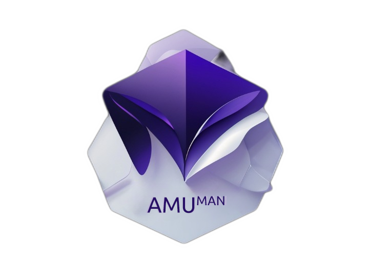

<!-- markdownlint-configure-file {
  "MD013": {
    "code_blocks": false,
    "tables": false
  },
  "MD033": false,
  "MD041": false
} -->

<div align="center">
  <!-- You are encouraged to replace this logo with your own! Otherwise you can also remove it. -->
  
  <br/>

  # AMU<sup>MAN</sup>

</div>

## About AMUman

AMUman Simulation Manager is a comprehensive tool designed to facilitate and streamline the process of managing simulations in scientific research, specifically tailored for AMUmax software, a fork of the well-known Mumax software. Developed at Adam Mickiewicz University, this manager aims to provide a user-friendly and efficient platform for handling complex simulation tasks.

## Key Features

- **Task Queue Management**: Efficiently manage and prioritize simulation tasks.
- **Real-Time Monitoring**: Track the progress of simulations in real-time.
- **Resource Allocation**: Optimize the usage of computational resources.
- **User-Friendly Interface**: Simplified user interaction for both novice and experienced users.
- **Scalability**: Designed to scale with increasing computational demands.

## Technologies and Frameworks

AMUman Simulation Manager utilizes a variety of technologies and frameworks to ensure robust performance and user-friendly experience:

- **Backend**
  - [Django](https://www.djangoproject.com/): A high-level Python Web framework that encourages rapid development and clean, pragmatic design.
  - [Django REST Framework](https://www.django-rest-framework.org/): A powerful and flexible toolkit for building Web APIs.
  - [Celery](http://www.celeryproject.org/): An asynchronous task queue/job queue based on distributed message passing.

- **Frontend**
- In the current release, the frontend is built using Django and Bootstrap. In the future, we plan to release a version based on a Vuejs: frontend: 
  - [Vue.js](https://vuejs.org/): The Progressive JavaScript Framework for building user interfaces.
  - [Vuetify](https://vuetifyjs.com/): A Vue UI Library with beautifully handcrafted Material Components.
  - [Axios](https://github.com/axios/axios): A promise-based HTTP Client for node.js and the browser.

## Installation

Provide a step-by-step guide on how to install and setup AMUman Simulation Manager.

```bash
# Step 1: Clone the repository
git clone https://github.com/kkingstoun/AMUman

# Step 2: Install dependencies
# ...

# Step 3: Makemigrations
python manage.py makemigrations --settings=amudmin.settings_manager

python manage.py migrate --settings=amudmin.settings_manager
python manage.py migrate --settings=amudmin.settings_node
python manage.py migrate --settings=amudmin.settings_client

```


# Usage
To run manager
```bash
python manage.py runserver 8000 --settings=amudmin.settings_manager
```
To run client
```bash
python manage.py runserver 8000 --settings=amudmin.settings_client
```
To run node
```bash
python manage.py runserver 8000 --settings=amudmin.settings_node```
```
